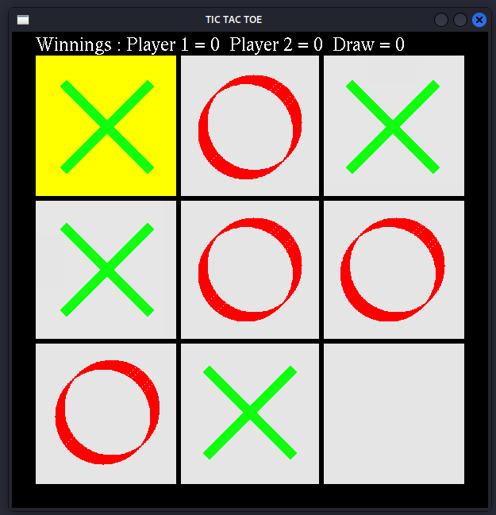

# Tic-Tac-Toe Game using OpenGL

### Introduction
This C++ code implements a classic Tic-Tac-Toe game using the OpenGL graphics library. The game features a simple graphical interface, allowing players to interact with the game board using the keyboard.

### Dependencies
* OpenGL
* GLUT (OpenGL Utility Toolkit)

### SCREENSHOTS

### Compilation
To compile the code, you'll need a C++ compiler that supports OpenGL and GLUT. The specific commands may vary depending on your compiler and operating system. A common approach is to use a Makefile or a build system like CMake.

### How to Play
1. Run the compiled executable.
2. Use the WASD keys to move the highlighted selection around the game board.
3. Press Enter to place your symbol (X or O) on the selected cell.
4. Players take turns until one player wins or the game ends in a draw.

### Game Logic
The game logic is implemented in the following functions:
* `iscomplete()`: Checks if the board is full (draw).
* `checkwinner()`: Determines if a player has won by checking rows, columns, and diagonals.
* `changeplayer()`: Switches between players.
* `gameinit()`: Resets the game board and player turns.
* `game()`: Handles player moves, checks for win or draw conditions, and updates the game state.

### Graphics
The OpenGL functions are used to draw the game board, pieces, and text messages. The `display()` function handles the main drawing loop.

### Limitations
* The code doesn't include error handling or input validation.
* The graphical interface is basic.

### Potential Improvements
* Add a menu system for game options (e.g., new game, exit).
* Implement sound effects for moves and win/draw conditions.
* Enhance the graphical interface with animations or better visuals.
* Add an AI opponent for single-player mode.

### Additional Notes
* The code uses global variables for simplicity, but using classes or structs to encapsulate game data would be a better approach for larger projects.
* Consider using a game loop structure for better control over game flow and updates.

**Enjoy playing Tic-Tac-Toe!**
